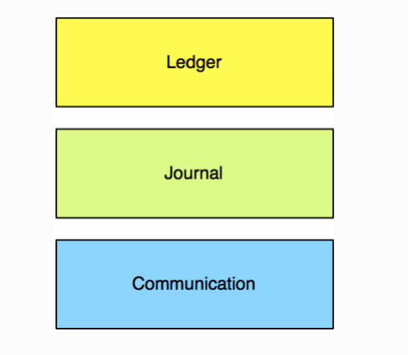
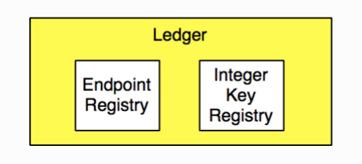
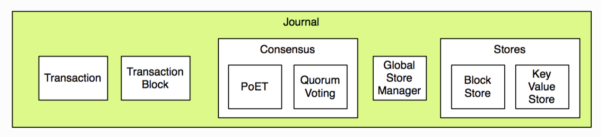
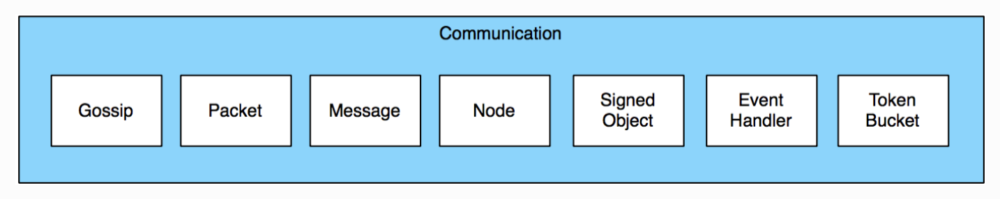

# Sawtooth

Sawtooth는 분산원장(Distributed Ledger)을 구축, 배포 및 실행하기 위한 모듈식 플랫폼으로 확장가능한 transaction 유형을 가진 소프트웨어 프레임워크

**특징**

- PoET(scalable consensus algorithm)
- Feature swappable consensus
- Easy to develop and deploy
- Supporting muli-language(python, go, rust, javascript)


## Compare with Fabric

|                     | Sawtooth                | Fabric             |
| ------------------- | ----------------------- | ------------------ |
| Consensus Algorithm | PoET                    | Kafka              |
| Size of the network | Large networks          | Small networks     |
| Security            | Roles and permissions   | MSP                |
| Governance          | Less tighter governance | Tighter governance |


## Architecture


**Client**

- Submit transactions
- Queries the database

**Validator Process**

- Mediates access to the database
- Validate transaction

**Transaction Processor(Chain code)**

- Handle Business logic

**Transaction Handling**

- Parallel scheduling


## Core

The Sawtooth Lake Distributed Ledger consists of three major architectural layers:

- Ledger layer 
- Journal layer
- Communication Layer




**Ledgers**

Ledgers are a conceptual semantic and data model layer for transaction types. In addition to some in-built system ledgers (Endpoint Registry, and Integer Key Registry), implementing new classes in the ledger layer allows for the creation of new `transaction families`. `Transaction family` is structured as client, state, transaction processor.



The MarketPlace Transaction Family, located in the extensions directory of sawtooth-core, is a good example of how the ledger layer can be extended.


**Journals**

A journal handles consensus on blocks of transactions. The journal provides global consensus on block ordering, transaction ordering within blocks, and the content of transactions.




**Communication**

Sawtooth Lake implements PoET as a consensus mechanism.




## Repository Structure

- Gossip networking layer
- Basic transaction, block, and message objects
- PoET journal consensus mechanism
- Built-in transaction families
- Validator(acts as a node on the gossip network)


## Example of Transaction Processors(Smart Contract)

The overall structure of transaction processor is similar to the `chaincode` of the fabric, and it runs as a process without using the docker.

**Package Structure**

|— src

|——— main.go

|——— handler

|—————— hander.go


**SmallBack Transaction Processor**

```Go
type SmallbankHandler struct {
}

func (self *SmallbankHandler) FamilyName() string {
	return "smallbank"
}

func (self *SmallbankHandler) FamilyVersions() []string {
	return []string{"1.0"}
}

func (self *SmallbankHandler) Namespaces() []string {
	return []string{namespace}
}

func (self *SmallbankHandler) Apply(request *processor_pb2.TpProcessRequest, context *processor.Context) error {
	payload, err := unpackPayload(request.GetPayload())
	if err != nil {
		return err
	}

	logger.Debugf("smallbank txn %v: type %v",
		request.Signature, payload.PayloadType)

	switch payload.PayloadType {
	case smallbank_pb2.SmallbankTransactionPayload_CREATE_ACCOUNT:
		return applyCreateAccount(payload.CreateAccount, context)
	case smallbank_pb2.SmallbankTransactionPayload_DEPOSIT_CHECKING:
		return applyDepositChecking(payload.DepositChecking, context)
	case smallbank_pb2.SmallbankTransactionPayload_WRITE_CHECK:
		return applyWriteCheck(payload.WriteCheck, context)
	case smallbank_pb2.SmallbankTransactionPayload_TRANSACT_SAVINGS:
		return applyTransactSavings(payload.TransactSavings, context)
	case smallbank_pb2.SmallbankTransactionPayload_SEND_PAYMENT:
		return applySendPayment(payload.SendPayment, context)
	case smallbank_pb2.SmallbankTransactionPayload_AMALGAMATE:
		return applyAmalgamate(payload.Amalgamate, context)
	default:
		return &processor.InvalidTransactionError{
			Msg: fmt.Sprintf("Invalid PayloadType: '%v'", payload.PayloadType)}
	}
}

func applyCreateAccount(createAccountData *smallbank_pb2.SmallbankTransactionPayload_CreateAccountTransactionData, context *processor.Context) error {
	account, err := loadAccount(createAccountData.CustomerId, context)
	if err != nil {
		return err
	}

	if account != nil {
		return &processor.InvalidTransactionError{Msg: "Account already exists"}
	}

	if createAccountData.CustomerName == "" {
		return &processor.InvalidTransactionError{Msg: "Customer Name must be set"}
	}

	new_account := &smallbank_pb2.Account{
		CustomerId:      createAccountData.CustomerId,
		CustomerName:    createAccountData.CustomerName,
		SavingsBalance:  createAccountData.InitialSavingsBalance,
		CheckingBalance: createAccountData.InitialCheckingBalance,
	}

	saveAccount(new_account, context)

	return nil
}

func applyDepositChecking(depositCheckingData *smallbank_pb2.SmallbankTransactionPayload_DepositCheckingTransactionData, context *processor.Context) error {
	account, err := loadAccount(depositCheckingData.CustomerId, context)
	if err != nil {
		return err
	}

	if account == nil {
		return &processor.InvalidTransactionError{Msg: "Account must exist"}
	}

	new_account := &smallbank_pb2.Account{
		CustomerId:      account.CustomerId,
		CustomerName:    account.CustomerName,
		SavingsBalance:  account.SavingsBalance,
		CheckingBalance: account.CheckingBalance + depositCheckingData.Amount,
	}

	saveAccount(new_account, context)

	return nil
}

func applyWriteCheck(writeCheckData *smallbank_pb2.SmallbankTransactionPayload_WriteCheckTransactionData, context *processor.Context) error {
	account, err := loadAccount(writeCheckData.CustomerId, context)
	if err != nil {
		return err
	}

	if account == nil {
		return &processor.InvalidTransactionError{Msg: "Account must exist"}
	}

	new_account := &smallbank_pb2.Account{
		CustomerId:      account.CustomerId,
		CustomerName:    account.CustomerName,
		SavingsBalance:  account.SavingsBalance,
		CheckingBalance: account.CheckingBalance - writeCheckData.Amount,
	}

	saveAccount(new_account, context)

	return nil
}
```

